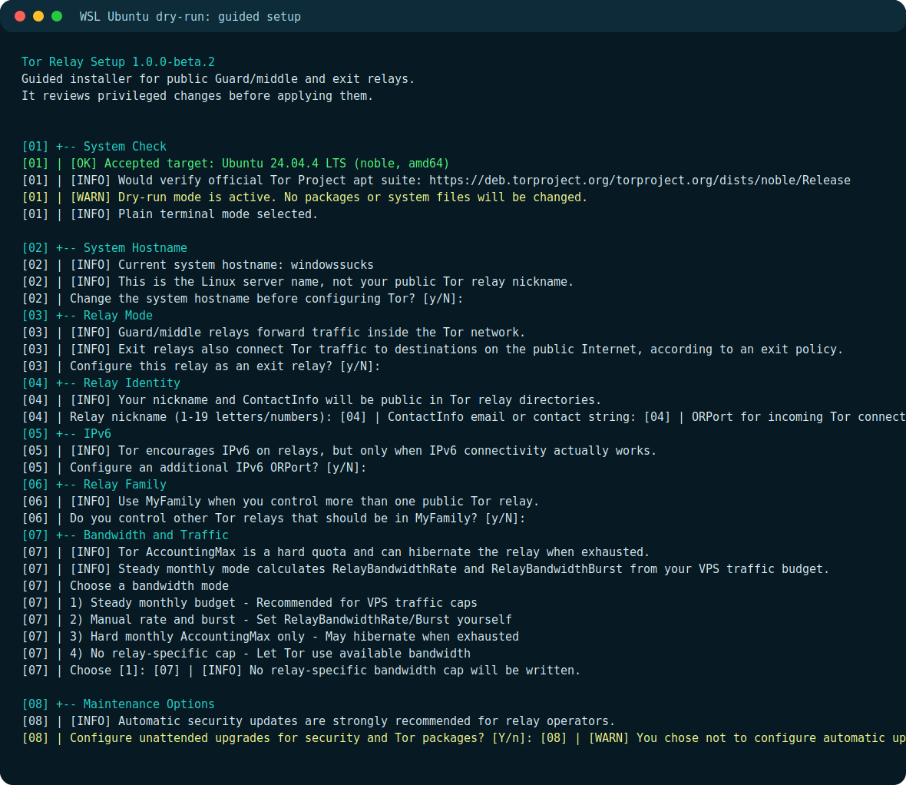
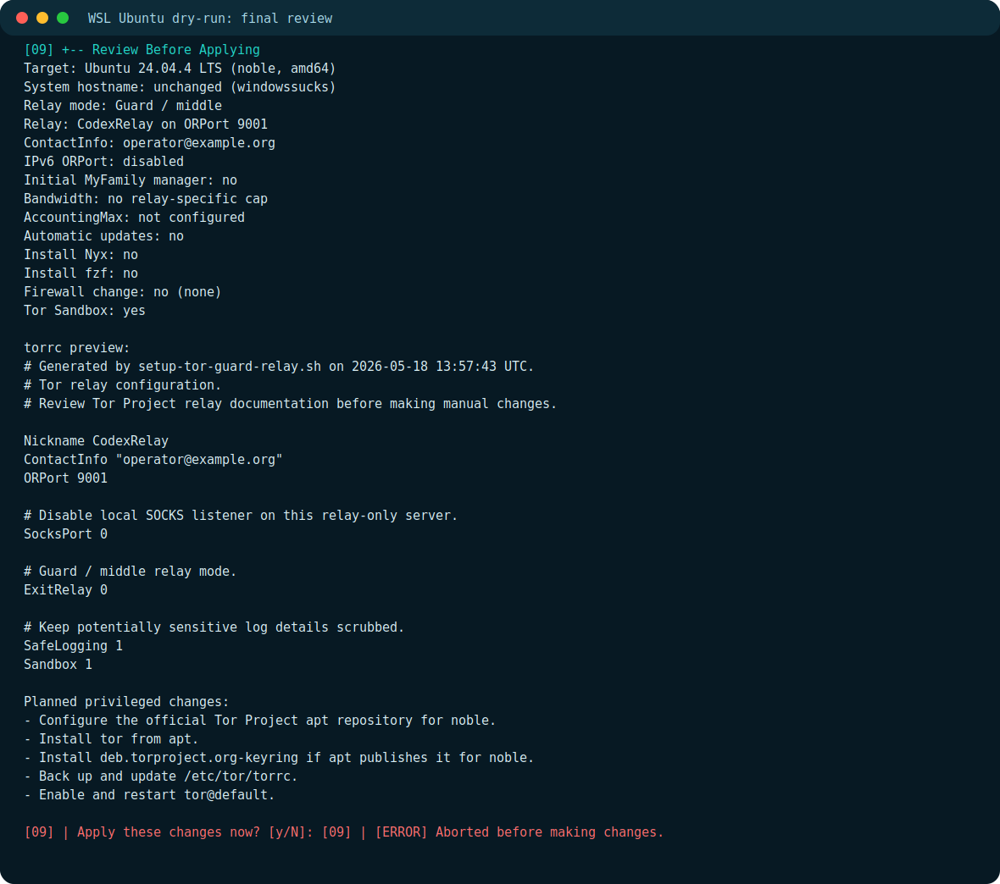

# Tor Relay Setup

<p align="center">
  
  
  
  
  
</p>

An interactive Bash operator console for setting up and maintaining a public Tor relay on a fresh Debian or Ubuntu VPS. It can configure a Guard/middle relay, or an exit relay when you explicitly choose the exit path and confirm the operational requirements.

It is designed for the normal relay-operator details: nickname, public contact string, bandwidth budget, ORPort, IPv6, firewall choice, and whether the machine is meant to be an exit relay. The script handles the boring sharp edges: Tor Project apt repository setup, key verification, torrc generation, backups, syntax checks, systemd, firewall rules, MyFamily fingerprints, and follow-up health checks.

## Project Map

- [Quick Start](#quick-start): verified release download and one-liner.
- [Operator Guide](docs/OPERATOR_GUIDE.md): day-two relay operation, MyFamily, backups, and cleanup boundaries.
- [Security Policy](SECURITY.md): reporting and safety boundaries.
- [Contributing](CONTRIBUTING.md): review rules and local checks.
- [Changelog](CHANGELOG.md): release history.
- [Release Guide](docs/RELEASE.md): maintainer release checklist.

## Status

`v1.0.0-beta.4` is a prerelease. It is experimental privileged server software, so review it before running it, prefer `--dry-run` first, and use disposable VPS testing when you are unsure.

This repository was built solely by **Codex 5.5 xhigh** from the project requirements, official Tor documentation, and live VPS test feedback. It works well in the tested paths, but the beta label is intentional: relay operators should still read the planned changes before approving them.

## First Look

These screenshots currently show the plain fallback dry-run under WSL Ubuntu 24.04. The normal path uses fzf when available, including selector prompts and command-output panels.





## Quick Start

Recommended path: download the tagged release asset, verify the checksum, review the script, then run it.

```bash
VERSION="v1.0.0-beta.4"
curl -fsSLO "https://github.com/ljkx/tor-relay-setup/releases/download/${VERSION}/setup-tor-guard-relay.sh"
curl -fsSLO "https://github.com/ljkx/tor-relay-setup/releases/download/${VERSION}/SHA256SUMS"
sha256sum -c SHA256SUMS
less setup-tor-guard-relay.sh
chmod +x setup-tor-guard-relay.sh
./setup-tor-guard-relay.sh --dry-run
sudo ./setup-tor-guard-relay.sh
```

One-liner download and start:

```bash
VERSION="v1.0.0-beta.4"; curl -fsSLo setup-tor-guard-relay.sh "https://github.com/ljkx/tor-relay-setup/releases/download/${VERSION}/setup-tor-guard-relay.sh" && chmod +x setup-tor-guard-relay.sh && sudo ./setup-tor-guard-relay.sh
```

Clone from GitHub:

```bash
git clone https://github.com/ljkx/tor-relay-setup.git
cd tor-relay-setup
git checkout v1.0.0-beta.4
./setup-tor-guard-relay.sh --dry-run
sudo ./setup-tor-guard-relay.sh
```

Useful modes:

```bash
./setup-tor-guard-relay.sh --help
./setup-tor-guard-relay.sh --version
sudo ./setup-tor-guard-relay.sh --plain
sudo ./setup-tor-guard-relay.sh --uninstall
```

Direct pipe mode is possible after review, but it is not the recommended path for privileged software:

```bash
VERSION="v1.0.0-beta.4"; curl -fsSL "https://github.com/ljkx/tor-relay-setup/releases/download/${VERSION}/setup-tor-guard-relay.sh" | sudo bash
```

## Supported Systems

The script supports systemd-based Debian-family VPSes when the official Tor Project apt repository publishes packages for the detected codename.

The script checks `https://deb.torproject.org/torproject.org/dists/<codename>/Release` before adding the Tor repository. This makes support broader than a hardcoded version list while still refusing systems Tor does not publish for.

Examples of Tor apt suites currently handled by this model include:

- Debian 12 `bookworm`
- Debian 13 `trixie`
- Debian `forky`
- Ubuntu 22.04 LTS `jammy`
- Ubuntu 24.04 LTS `noble`
- Ubuntu `questing`
- Ubuntu 26.04 LTS `resolute`

Requirements:

- Linux with systemd
- Debian or Ubuntu family
- `apt`, `dpkg`, and `systemctl`
- `amd64` or `arm64`
- a public IPv4 address for a normal public relay
- enough disk space and inodes for apt package operations

## What It Can Do

- Configure a Guard/middle relay with `ExitRelay 0`.
- Configure an exit relay only after explicit provider and abuse-handling confirmations.
- Install Tor from the official Tor Project apt repository.
- Verify the Tor Project signing key fingerprint.
- Verify the selected `tor` apt candidate comes from `deb.torproject.org`.
- Disable the local SOCKS listener with `SocksPort 0` for relay-only servers.
- Ask for IPv6, default to the detected global IPv6 address on Enter, and warn when IPv6 is manually kept after a failed or skipped check.
- Calculate steady bandwidth limits from a monthly traffic budget such as `10TB`.
- Optionally install Nyx.
- Ask directly at startup whether to install `fzf`, then use searchable selectors for menus, yes/no choices, guided text entry, list reviews, and command-output panels when available.
- Optionally install UFW, preserve detected SSH ports, open the ORPort, and enable UFW.
- Manage MyFamily by nickname or fingerprint through Tor Metrics Onionoo.
- Automatically add the relay's own fingerprint to MyFamily when available.
- Validate candidate torrc files before replacing `/etc/tor/torrc`.
- Create timestamped backups before replacing important files.
- Open an existing-relay operator console instead of forcing setup again.
- Remove traces of this script with `--uninstall` without removing Tor.

## What It Changes

After the final confirmation, the script may change:

- `/etc/hostname` and `/etc/hosts`, only if you choose a hostname change.
- `/etc/apt/sources.list.d/tor.sources`.
- `/usr/share/keyrings/deb.torproject.org-keyring.gpg`.
- apt packages: `tor`, optional `nyx`, optional `fzf`, optional `ufw`, optional `unbound`, optional unattended-upgrades packages.
- `/etc/tor/torrc`, after a backup and candidate syntax check.
- `/etc/apt/apt.conf.d/52tor-relay-unattended-upgrades`.
- `/etc/apt/apt.conf.d/20auto-upgrades`, when automatic updates are selected.
- firewall rules, only after confirmation.
- `/etc/resolv.conf`, only for exit relay DNS when Unbound is selected.
- `/var/lib/tor-relay-setup`, a tiny state directory used for script-owned traces.

It does not collect secrets, phone home, or implement telemetry.

## Generated torrc Shape

Guard/middle mode:

```torrc
Nickname MyRelay
ContactInfo "operator@example.org"
ORPort 9001
SocksPort 0
ExitRelay 0
SafeLogging 1
Sandbox 1
```

Exit mode with the reduced policy:

```torrc
Nickname MyExit
ContactInfo "operator@example.org"
ORPort 9001
SocksPort 0
ExitRelay 1
ReducedExitPolicy 1
SafeLogging 1
Sandbox 1
```

Optional steady budget example for a `10TB` monthly quota, counted as combined inbound + outbound with 10% headroom:

```torrc
RelayBandwidthRate 1864 KBytes
RelayBandwidthBurst 9320 KBytes
AccountingStart month 1 00:00
AccountingRule sum
AccountingMax 9216 GBytes
```

## Existing Relay Console

When `/etc/tor/torrc` already contains an `ORPort`, the script opens a relay console with:

- MyFamily manager
- health check
- Tor Metrics / Relay Search status
- `tor@default` service controls
- logs and ORPort self-test
- safe config editor
- torrc and identity-key backups
- package tools
- repair tools
- command log viewer
- local operator report
- script-trace cleanup
- full guided setup again

The MyFamily manager stores fingerprints, not nicknames. Nickname lookup uses Onionoo, shows candidate relays, and asks you to choose the exact fingerprint because nicknames are not unique.

Tor's documented `MyFamily` syntax prefixes fingerprints with `$`, so the generated torrc line intentionally looks like `MyFamily $FINGERPRINT,$OTHERFINGERPRINT`.

With `fzf`, setup choices stay in the selector flow: yes/no prompts become two-row selectors, text prompts use fzf's query field, Space marks rows, and the preview pane shows row context. Command output from apt, systemctl, firewall tools, and service actions is captured into local command logs and shown in a scrollable fzf command window. In delete screens, `d` reviews selected deletion(s) before confirmation. In plain mode, type the listed answers.

## Security Notes

- Review any privileged script before running it.
- If `fzf` is missing, the script asks whether to install it before the main guided flow. Declining keeps a plain line interface; `--plain` skips fzf entirely.
- Command logs are local temporary files for the current run. They are there for review and troubleshooting; they are not telemetry.
- `ContactInfo` is public in relay directories.
- MyFamily should include every relay controlled by the same operator, and the same family should be applied on each relay.
- Guard/middle mode writes `ExitRelay 0`; exit mode writes `ExitRelay 1`.
- Exit relays need provider permission, abuse handling, and clear public operator contact posture.
- Exit DNS uses local Unbound when selected, following Tor's Debian/Ubuntu exit guidance.
- Do not enable IPv6 unless it actually works. If you override a failed or skipped IPv6 check, treat IPv6 as unverified until Relay Search shows the IPv6 OR address.
- Keep SSH access open. The script allows detected SSH ports before enabling UFW, but provider consoles are still wise when changing firewalls.
- Cloud firewalls live outside the VPS. Open the ORPort in the provider panel too.
- Leave `SafeLogging 1` enabled.
- Do not publish real-time relay/system metrics; Tor recommends aggregation windows of at least a day when publishing statistics.
- Back up `/var/lib/tor/keys` after the relay is stable. Those identity keys are sensitive.

## Relay Lifecycle

New relays do not receive full traffic immediately.

- Relay Search usually sees a new relay after about 3 hours.
- Bandwidth authorities need time to measure it.
- Guard usage depends on stability and can take longer to ramp up.
- MyFamily changes can take hours to appear everywhere.

Relay Search:

```text
https://metrics.torproject.org/rs.html
```

## Troubleshooting

Service status:

```bash
systemctl status tor@default --no-pager
```

Follow logs:

```bash
journalctl -u tor@default -f
```

Look for ORPort self-test:

```bash
journalctl -u tor@default --since "1 hour ago" | grep -F "Self-testing indicates"
```

Check the listener:

```bash
ss -ltn | grep ':9001'
```

Verify torrc:

```bash
tor --verify-config -f /etc/tor/torrc
```

Common issues:

- `apt` reports `No space left on device`: check `df -h` and `df -ih`, free space, then retry.
- checksum mismatch: delete the downloaded files and fetch the release asset again; do not run a mismatched script.
- GitHub release asset missing: use the clone path and check out the tag, or wait for the release upload to finish.
- apt signing/keyring failure: check system time, DNS, and whether the expected Tor signing key fingerprint is shown.
- Tor apt suite missing: the detected Debian/Ubuntu codename is not published by Tor yet.
- ORPort not reachable: check UFW/firewalld/nftables, provider firewall, NAT, and cloud security groups.
- IPv6 enabled but not published: verify outbound IPv6, local IPv6 listener, provider firewall, and Relay Search after a few hours.
- relay hibernates early: lower the steady rate, increase headroom, or choose the combined inbound + outbound accounting rule.
- exit DNS broken: check `systemctl status unbound --no-pager`, `unbound-checkconf`, and `/etc/resolv.conf`.

Useful cleanup after an interrupted apt operation:

```bash
sudo apt clean
sudo rm -rf /var/lib/apt/lists/partial/*
sudo apt update
```

## Updating

If unattended upgrades were enabled, security and Tor package updates should happen automatically.

Manual update:

```bash
sudo apt update
sudo apt install --only-upgrade tor
apt-cache policy tor deb.torproject.org-keyring
sudo systemctl restart tor@default
```

Update this tool by downloading a newer tagged release asset and running `--dry-run` first.

## Cleaning Up This Tool

To remove traces of this installer itself without touching Tor:

```bash
sudo ./setup-tor-guard-relay.sh --uninstall
```

Cleanup mode can remove:

- the script state directory under `/var/lib/tor-relay-setup`
- operator reports that contain this tool's report header
- the downloaded standalone script file
- a clean cloned repo checkout with the expected GitHub remote
- `fzf`, only if this script recorded that it installed `fzf`

Cleanup mode deliberately does **not** remove Tor, `/etc/tor/torrc`, `/var/lib/tor`, relay identity keys, firewall rules, logs, the Tor apt repository, Unbound, or hostname changes. Those are relay/system state, not script traces.

If you actually want to retire a relay, plan that separately. Deleting `/var/lib/tor` destroys relay identity keys and loses relay reputation.

## Development Checks

```bash
make check
```

That expands to Bash syntax, ShellCheck, function tests, helper syntax, and help/version smoke checks.

Regenerate README screenshots from a captured dry-run transcript:

```bash
make render-screenshots
```

GitHub Actions runs these checks on push and pull request.

## Official Tor Sources

This script follows official Tor Project documentation first:

- [Tor relay technical setup](https://community.torproject.org/relay/setup/)
- [Debian/Ubuntu Middle/Guard relay setup](https://community.torproject.org/relay/setup/guard/debian-ubuntu/)
- [Types of relays](https://community.torproject.org/relay/types-of-relays/)
- [Exit relay setup](https://community.torproject.org/relay/setup/exit/)
- [Debian/Ubuntu exit relay DNS setup](https://community.torproject.org/relay/setup/exit/debian-ubuntu/)
- [Tor Debian/Ubuntu package installation](https://support.torproject.org/little-t-tor/getting-started/installing/)
- [Relay post-install and good practices](https://community.torproject.org/relay/setup/post-install/)
- [Running multiple relays / MyFamily](https://support.torproject.org/relays/getting-started/my-family/)
- [Relay requirements](https://community.torproject.org/relay/relays-requirements/)
- [Technical considerations](https://community.torproject.org/relay/technical-considerations/)
- [Bandwidth limits](https://support.torproject.org/relays/performance/bandwidth-limits/)
- [Tor Metrics Onionoo protocol](https://metrics.torproject.org/onionoo.html)
- [Expectations for relay operators](https://community.torproject.org/policies/relays/expectations-for-relay-operators/)
- [Lifecycle of a new relay](https://blog.torproject.org/lifecycle-of-a-new-relay/)

When behavior is unclear or distro-specific, prefer those sources over third-party guides.
